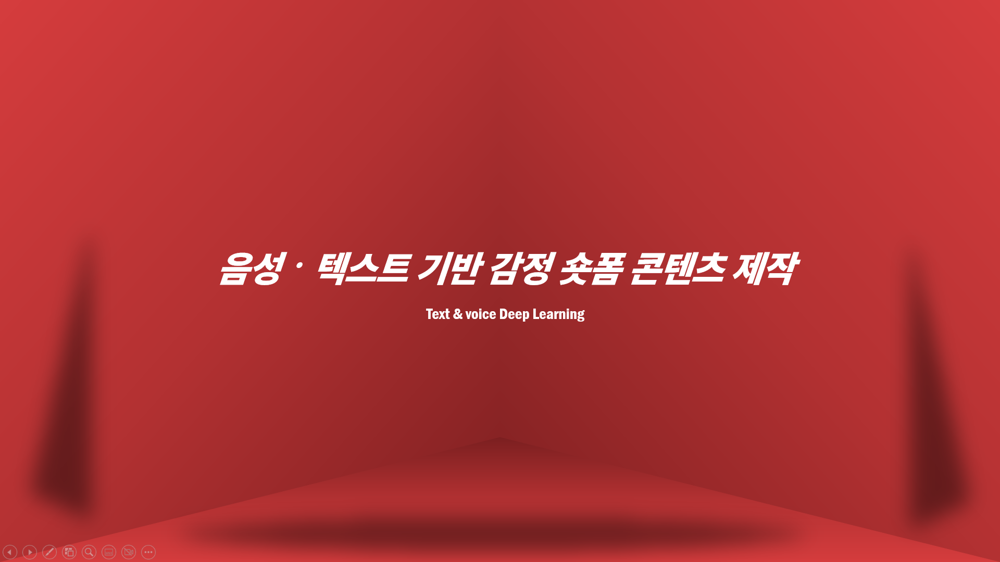
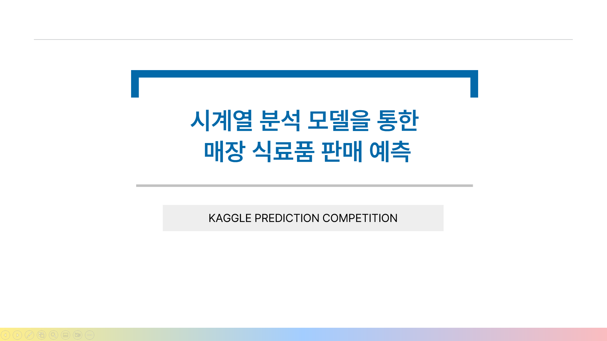
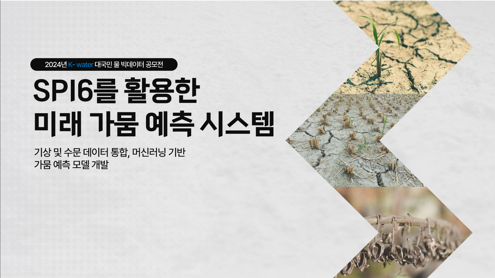
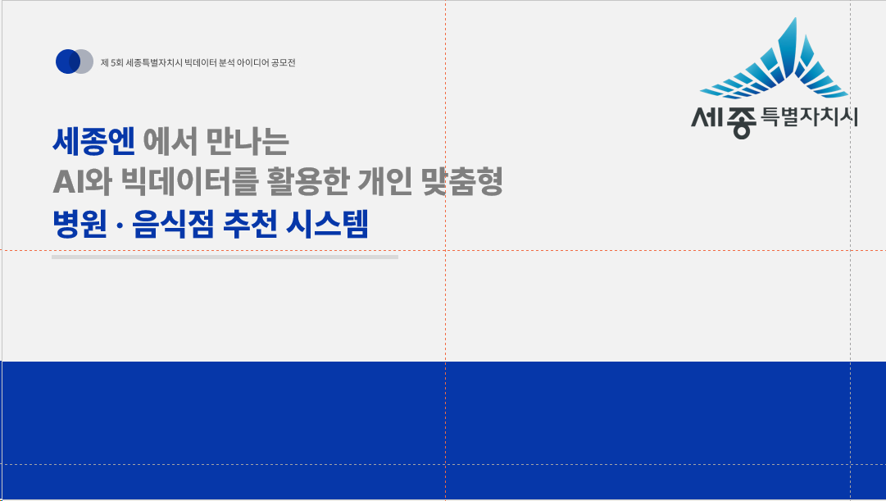

## 📂 Team Project  
|  |  |  
|:---------------------------------------:|:---------------------------------------:|  
| **딥러닝 Project** 텍스트 · 음성 기반 감정 분석 시스템 개발 | **SQL Project** 태풍과 기상 데이터 분석 |  

|  |  
|:---------------------------------------:|  
| **파이썬 시계열 데이터 분석 Project** 시계열 분석 모델을 통한 매장 식료품 판매 예측 |  

---
 
## 🏆 Contest Project  
|  |  |  
|:---------------------------------------:|:---------------------------------------:|  
| **수자원 공모전 Project** SPI6를 활용한 미래 가뭄 예측 시스템 | **세종시 공모전 Project** 세종시 데이터 기반 개인 맞춤형 병원 · 음식점 추천 시스템 |

---

